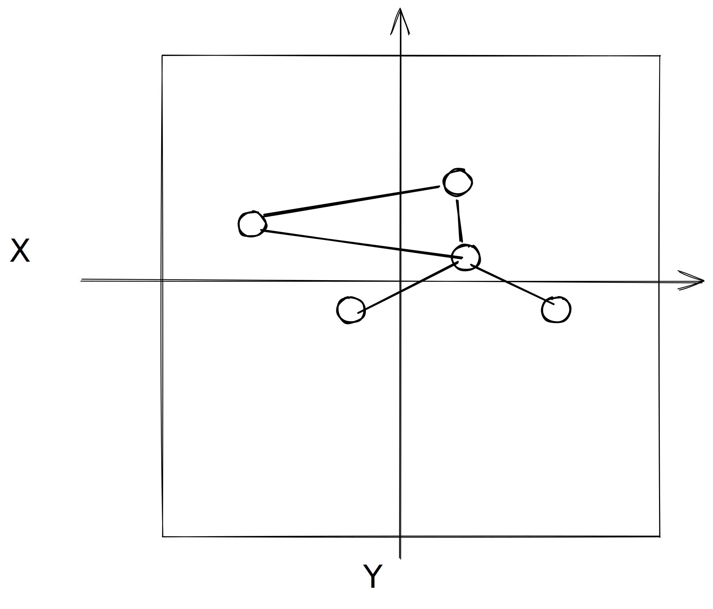
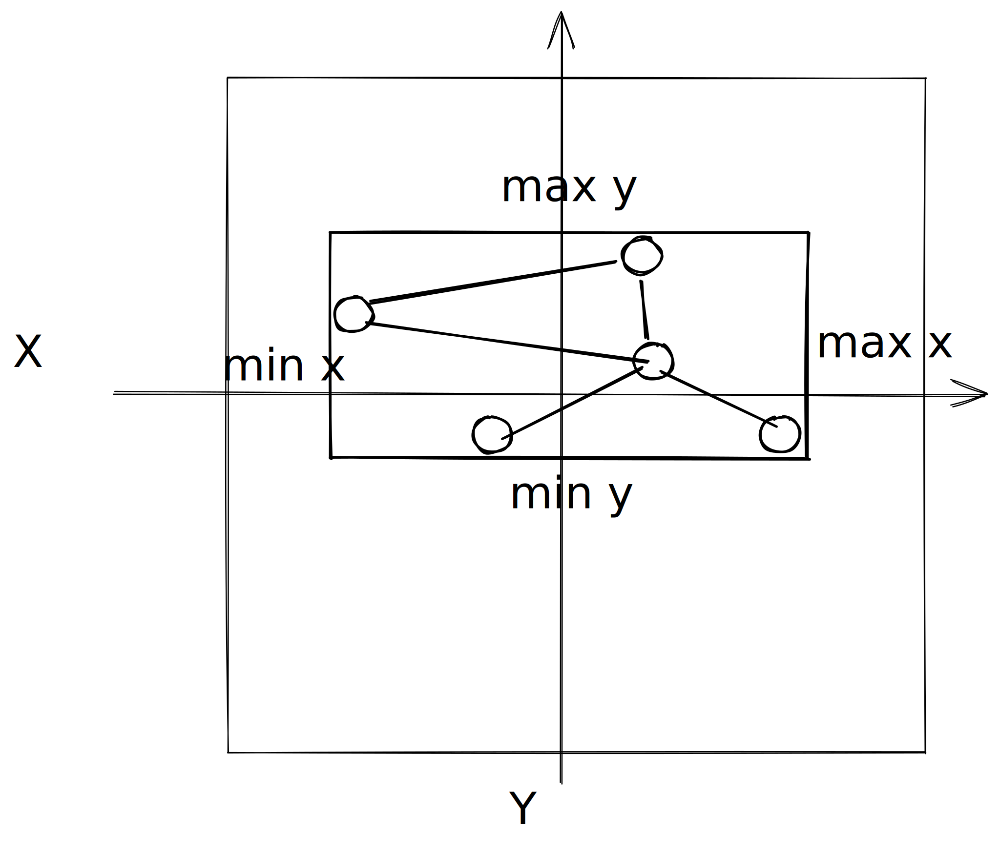

# Sigma coordinate sytems

## 1. The graph space: `graph`

The graph contains nodes having arbitrary `(x, y)` positions.

## 2. Normalized graph space: `framedGraph`

First we compute the extend (min & max values) for `x` and `y` coordinates in graph space.

Then we normalize this space into a square such that graphspace `min` becomes `0` and graphspace max `1`.
