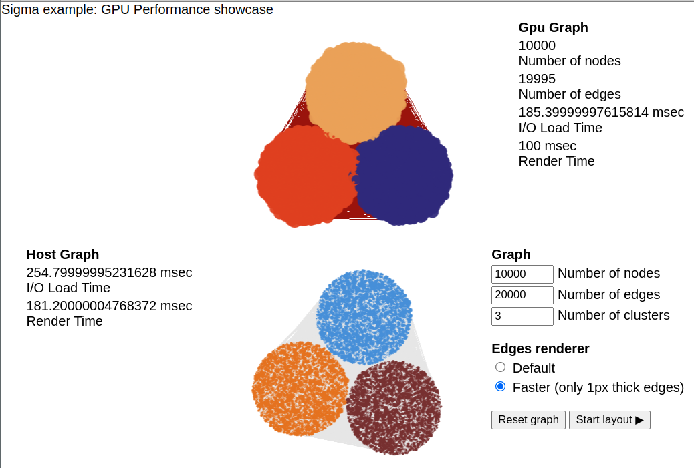
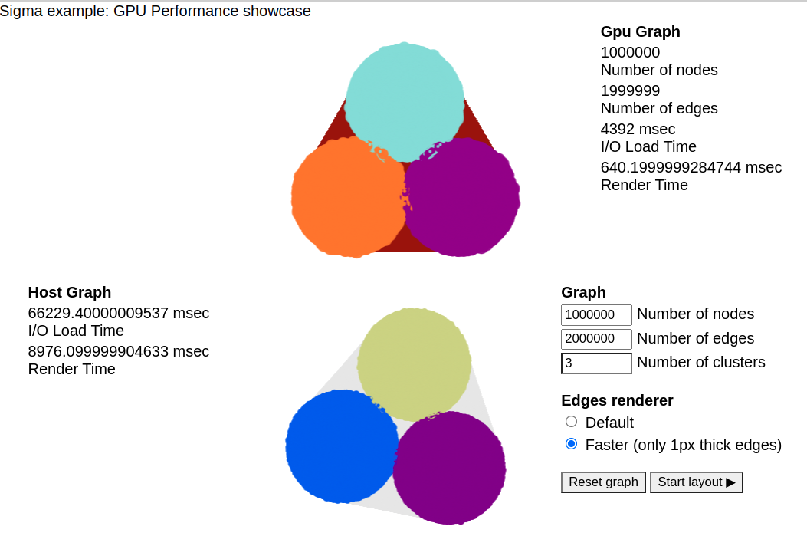

# Extra Large Graphs Demo with `@rapidsai/node` GPU acceleration

RAPIDS.ai is an open source GPU-acceleration project. We're building new
tools with familiar APIs and extending existing tools to that more
scientists and users can take advantage of GPU performance.

This project creates a `RapidsGraphologyGraph` subclass of `Graph`,
plus a modified `index.ts` to make GPU-stored graph vertices and edges
available to your browser session. It talks to the `@rapidai/demo-api-server`
that has been built using [node-rapids](https://www.github.com/rapidsai/node).

# Performance

Using a GPU for graph rendering offers substantial performance increases.
In this demo, I've included screenshots of performance comparison's between
using our GPU-backed `RapidsGraphologyGraph` and the original renderer
included in the `large-graphs` demo.

When the complexity of the graph matches the original demo, performance
is comparable:



When the complexity increases substantially, the GPU performance improvement
is marked:



It is important to note in the larger case that the "I/O" benchmark for
the original `large-graphs` demo includes the graph generation time, which
is substantial. However, were the file stored in a 500MB .json (as in the
GPU case) and parsed in-browser, execution time is similar or longer.

# What Is Happening

In order to run this demo, you need the `@rapidsai/demo` npm package,
a system with an NVIDIA GPU from around 2018 forward (Turing architecture
and up), and have previously installed the [CUDA Toolkit] (https://developer.nvidia.com/cuda-toolkit).

The node-rapids workspace [demo-api-server](https://github.com/rapidsai/node)
is available as a backend to any HTTP client. At this time only limited
functionality is available to parse JSON files in the `graphology`
graph dataset format, plus API requests to request Dataframes and
their Columns via `apache-arrow`.

Two endpoints, `graphology/nodes` and `graphology/edges` specifically
return pre-formatted arrays that can be used directly with the
[sigma.js](https://github.com/jacomyal/sigma.js) renderer.

## Additional Dependencies

- @rapidsai/demo-api-server
- apache-arrow

## To run the demo

Due to native dependency distribution complexity, pre-packaged builds of
the node-rapids modules are presently only available via our [public docker images](https://github.com/orgs/rapidsai/packages/container/package/node).
See [USAGE.md](https://github.com/rapidsai/node/tree/main/USAGE.md) for more details.

Run `@rapidsai/demo-api-server` via docker:

```bash
REPO=ghcr.io/rapidsai/node
VERSIONS="22.02.00-runtime-node18.2.0-cuda11.6.2-ubuntu20.04"

# Be sure to pass either the `--runtime=nvidia` or `--gpus` flag!
docker run --rm \
    --runtime=nvidia \
    -e "DISPLAY=$DISPLAY" \
    -v "/etc/fonts:/etc/fonts:ro" \
    -v "/tmp/.X11-unix:/tmp/.X11-unix:rw" \
    -v "/usr/share/fonts:/usr/share/fonts:ro" \
    -v "/usr/share/icons:/usr/share/icons:ro" \
    $REPO:$VERSIONS-demo \
    npx @rapidsai/demo-api-server
```

We expect to have full `npm` support soon.

Next generate a graph of your liking, or provide another:

```bash
cd $SIGMAJSHOME/examples/extra-large-graphs
node generate-graph.js 10000 20000 3 graphology.json
cp graphology.json $DOCKERROOT/node/modules/demo/api-server/public
```

Finally run the `extra-large-graphs` demo in the normal fashion:

```bash
cd $SIGMAJSROOT/examples
npm start --example=extra-large-graphs
```  

## Dataset

Run the graph generator at <https://github.com/thomcom/sigma.js/blob/add-gpu-graph-to-example/examples/extra-large-graphs/generate-graph.js>
to create a very large graph using the command:

```bash
node graph-generator.js 1000000 2000000 3 graphology.json
```
Any dataset that matches the schema of `graphology.json` is supported.

