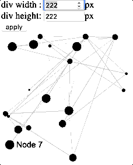

sigma.plugins.fillDiv
=====================


Plugin developed by [Ingun Jon](https://github.com/ingun37), 
---
This plugin provides a method to reposition nodes to be compact in div.

## Usage

You can create the plugin like this
````javascript
p = sigma.plugins.fillDiv(s, r);
````
while `s` be the sigma instance and `r` be the renderer bound to the container in which you want fill.

Then call `fill()` to fill
````javascript
p.fill();
````
Please refer to example `fill-div.html` for more detailed usage.